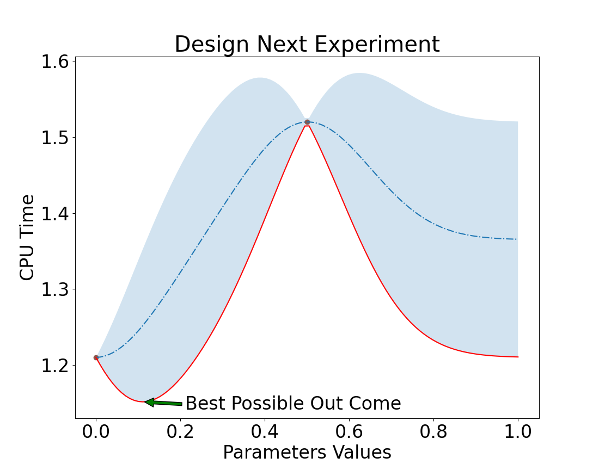
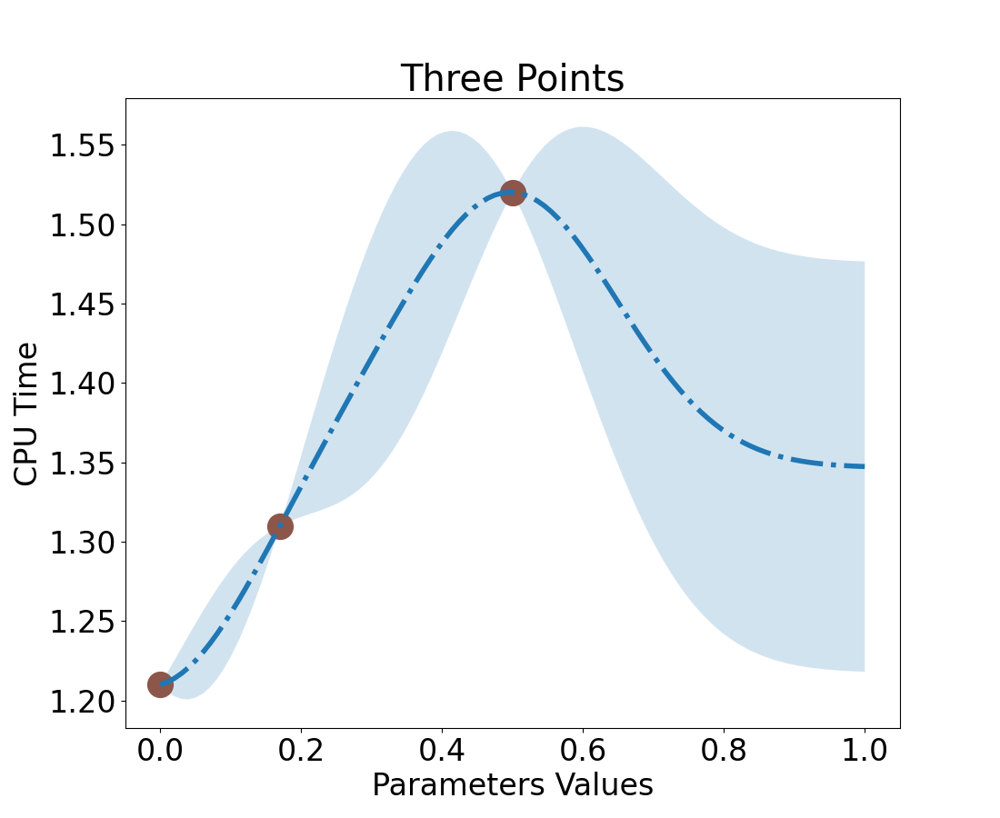
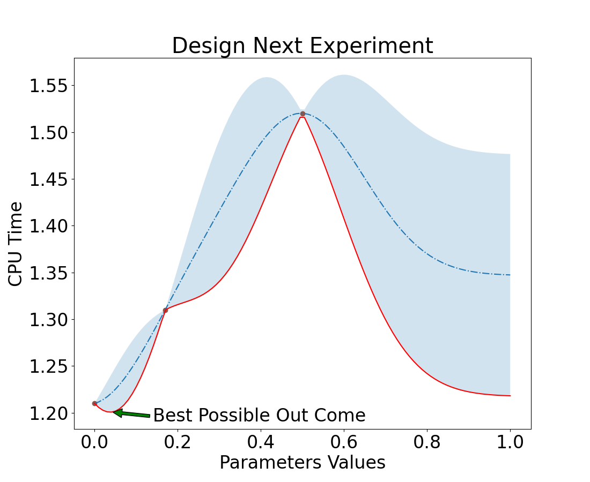
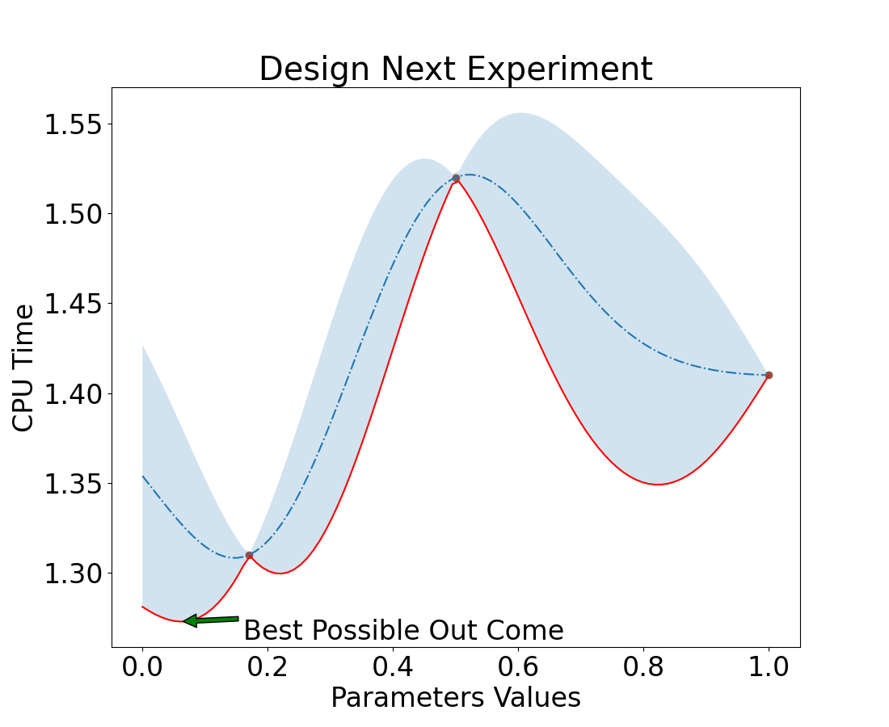
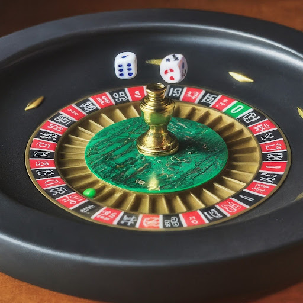
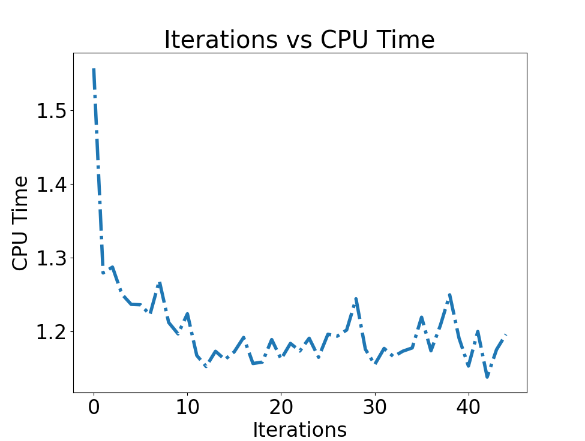

## Why Design an Experiment

It cost money to run an experiment!   
It also cost money to train algorithms and implement algorithms.  
<br>
GPU time is expensive, if you can train and run on a CPU you can save a lot of money. 

<br>
<br>  
How do you know if you can reduce sample size and runtime?

---

### With Math!

There are mathematical models you can use to identify what is the number of sample you need to get good results. (see A/B testing)

<br>
In addition, not knowing how to adjust your experiment to meet the risk, can **cost you your job** and/or the company a lot of money.

<br>
When, Google debuted their Bard, it failed. It cost the company $100B in valuation. This was a high risk demo. 

<br>
You need to know how to adjust your experiments for the risk!

This is where design experimentation comes in. How does one adjust for risk while reducing the cost of running the experiment.  

<br>

One way to reduce cost and risk is to set-up an A/B Test, but that is only good for two variables: A and B.  
How do you design an experiment when you have lots of variables.  

This is were **Bayesian Optimization** comes in.

---

## Bayesian Optimization: BO

Bayesian optimization is a sequential design strategy for global optimization of **black-box** functions that does not assume any functional forms.  

<br>
<br>  

### How is this Machine Learning?  

Machine Learning Models have multiple hyper-parameters that need to be optimized.  
<br>   

The model is a _black-box_ function.  
Training a ML model can take hours to weeks per configuration.  
You want to quickly find the hyper-parameters that work well and before this decade ends!

---

## Bayesian Optimization: BO

Bayesian optimization is a sequential design strategy for global optimization of black-box functions that does not assume any functional forms.  

<br>

### How is this useful for Software Engineering?

:::: {.columns}  
::: {.column width=60%}  

Say you need to speed up the a web application.  You can control seven parameters.
However, each experiment will take an hour to run. (@sweet)

* BO: would take 2 days to run!
  * Yes, it is that good.
* Grid: at 1/10 span spacing would take 10**7/24 = 417,000 days  

<br>

#### It is worth the time to set up a Bayesian Optimization algorithm!

:::   
::: {.column width=38%}  


:::  
::::

---

## Software Engineering Example

The following example is from "Experimentation for Engineers", by Dr. Sweet (@sweet).  
<br> 

### Outline of Talk

* Optimize a single parameter
* Model the Response Surface
* Optimize over the Acquisition Function
  * Expected result - uncertainty (aka Lower Confidence Bound (LCB))
* Pull it all together for a multi variable Bayesian Optimization

---

## Bayesian Optimization Flow


---

:::: {.columns}  
::: {.column width=49%}  

### Single Parameter

What do we know about the system?

### Our system  

* Single parameter: bounded between 0 - 1
* Current CPU run time: 1.2 hours
* Seen system take over 2 hours
* Uncertainty, is constant
   * We have not made a measurement!
   * So we do not know how the system will respond.
      * We could make it worse or better.

Look, we have a response surface!  (shaded blue area)  
<br>  
Let's take a measurement.

:::  
::: {.column width=50%}  


:::  
::::

---

## What measurement should we take first?

Let's take a value in the middle.

* Value = 0.5

### Run CPU test.

Which results in

* CPU Time is ~1.5  

<br>  
<hr>

So, what happens to our uncertainty.  

* near value = 0.5?
* near 0? 
* near 1?

---

## Take a measurement

:::{.columns}
::::{.column width=69%}


::::
::::{.column width=29%}

Note: Uncertainty follows an exponential decay: $exp(-x^2)$

::::
:::

---

## Now what, 

How do we decide on which point to take next?

### Pick a point that has the highest uncertainty!  

We want to reduce uncertainty.   
<br>
<hr>  
<br>

:::{.columns}
::::{.column width=49%}

Let's make another measurement.

* Pick, Value = 0  
  * We could have chosen 1 too.
<br>

### Run CPU Test 

* Result = ~1.2  
<br>

::::
::::{.column width=49%}


::::
:::

---


---

## Design next Experiment
:::{.columns}
::::{.column width=49%}

We want to pick a value that lowers uncertainty but,  
has the best expected outcome.

::::
::::{.column width=49%}


::::
:::

### Focus on the Goal
Remember our goal is to make the website faster.  

---




## Nice, but how did you make that response surface?

<br>

The shaded area is our uncertainty  times  the standard deviation of results (y).  

* $uncertainty * \sigma_y$

<br>

### How is uncertainty calculated?

```python

def kernel(self, x1, x2):
  # find the distance between a measured and unmeasured point
  # Want to weight points near a measured one more
  distance_squared = ((x1-x2)**2)
  return np.exp(-distance_squared/(2*self.sigma**2))

def estimate(self, query_parameter):
  kernels_x_query = np.array([self.kernel(x, query_parameter)
                              for x in self.x])
  kernels_x_x = np.array([[
      self.kernel(x1, x2) for x1 in self.x]
      for x2 in self.x])
  weights= kernels_x_query.T @ np.linalg.inv(kernels_x_x)
  expectation = self.mean_y + weights @ self.y  # Dashed line
  uncertainty_squared = 1 - weights @ kernels_x_query
  uncertainty = np.sqrt(uncertainty_squared)
  return expectation, self.std_y*uncertainty
```

## Run the experiment 

Value = .17

```python
import bo_scripts as bo
# GPR is Gaussian Processes Response
x = [0.5, 0.0, ]
y = [1.52, 1.21]
sigma = .5
gpr = bo.GPR4(x, y, sigma)
x_hat = 0.17  # Our value    
y_hat, uncertainty = gpr.estimate(x_hat) 
print(f"y_hat is {round(y_hat,2)} with uncertainty={round(uncertainty,2)}")

```
```bash
y_hat is 1.31 with uncertainty=0.02
```
---

### Resulting in a new response surface



## Converging to Optimal Solution

We can see that we are converging quickly to an optimal solution

<br>
<hr>
### If Second Measure had value 0 or 1
Remember we chose 0 to be our second value.  We still get the same solution.

| Value = 0 | Value = 1 |
|:---- |:---|
|  | 


## Now Multi Variables

This is where the fun begins.

### Given
Our CPU test takes 1 hour and we want to sample each variable 10 times.  
<br>

### How long would it take to run this experiment.

* 10 * 10 * 10 * 10 * 10 * 10 * 10
* $10^7$
* ~ 417,000 days

In 1000 years no one is going to care about your website.  
<br>
So how do we improve the website while the content is still current?

## Random Search
<br>
<br>
<br> 

### Wait!!!!!  

## What,
### How is this different than Monte Carlo Method

Monte Carlo method is similar in a sense that we randomly select values to run our experiment.  

:::{.columns}
::::{.column width=49%}
<br>

However, in Bayesian Optimization we feed in past results and model the response surface to know if we are moving in the right direction.  
<br>  

We can see how the systems is converging to an **optimized** solution.

::::
::::{.column width=49%}



::::
:::


## BO with Random Search

* Generate our next design experiment by adding  (small) random number to each value in your *vector*
* Evaluate this new vector of parameters
* Compare old and new vector results, take best.
* Repeat

## BO with Random Search

#### Ask

* Calculate the response curve and find the low confidence band (LCD)
* Spend some time looking for the new vector to try, via **estimates**.
  * Each iteration we estimate our expectation.
  * Test if lcb is lower with the new vector
  * Repeat 200 times
* Export the best vector


#### Tell

* Actually run the experiment (~1 hour)
* Append measurements 

#### Lastly
* Repeat for 2 days (48 runs)
  * Note: It will take longer to calculate the estimates, when the number of measurements increase.

## BO Results




## Lets look at the code.
 
[](bo_scripts.py)

## Thank you
