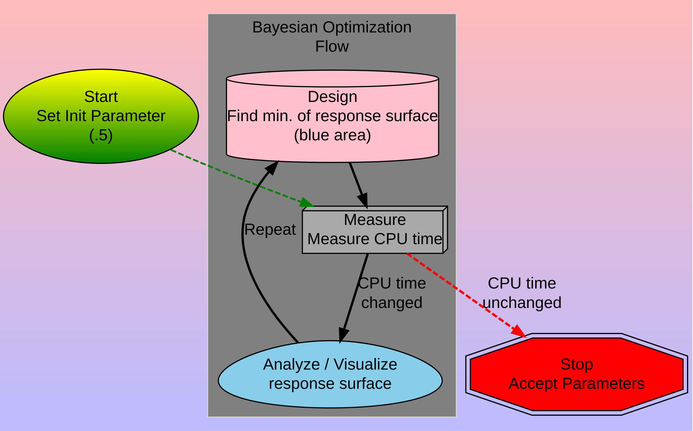

## Why Design an Experiment

It cost money to run an experiment! 
It also cost money to train algorithms and implement algorithms.
 
GPU time is expensive, if you can train and run on a CPU you can save a lot of money.  
How do you know if you can reduce sample size and runtime?

 
There are mathematical models you can use to identify what is the number of sample you need to get good results. (see AB testing)

 
In addition, not knowing how to adjust your experiment to meet the risk, can **cost you your job** and or the company a lot of money.

 
When, Google debuted their Bard, it failed. It cost the company $100B in valuation. This was a high risk demo. 

 
You need to know how to adjust your experiments for the risk!

This is where design experimentation comes in. How does one adjust for risk while reducing the cost of running the experiment.

 

One way to reduce cost and risk is to set-up an A/B Test, but that is only good for two (A and B) variables.  How do you design an experiment when you have lots of variables.  
This is were Bayesian Optimization comes in.

---

## Bayesian Optimization
Bayesian optimization is a sequential design strategy for global optimization of black-box functions that does not assume any functional forms.  
  
### How is this Machine Learning?
Machine Learning Models have multiple hyper-parameters that need to be optimized. The model is a _black-box_ function. Training a ML model can take hours to weeks per configuration. You want to quickly find the hyper-parameters that work well and before  this decade ends!

---
### How is this useful for Software Engineering?

:::{.columns}
::::{.columns width=60%}

Say you need to speed up the a web application.  You can control seven parameters.
However, each experiment will take an hour to run. (@sweet)

* BO: would take 2 days to run!
* Grid: at .1 spacing would take 10**7/24 = 417,000 days

#### So it is worth the time to set up, Bayesian Optimization algorithm!

::::  
::::{.columns width=38%}

::::
:::

---

## Software Engineering Example

The following example is from "Experimentation for Engineers", by Dr. Sweet.

* Optimize a single parameter
* Model the Response Surface
* Optimize over Acquisition Function
  * Expected result - uncertainty (aka Lower Confidence Bound)
* Do a Bayesian Optimization

---

## Bayesian Optimization Flow

---

## Single Parameter

---

## Take a measurement

